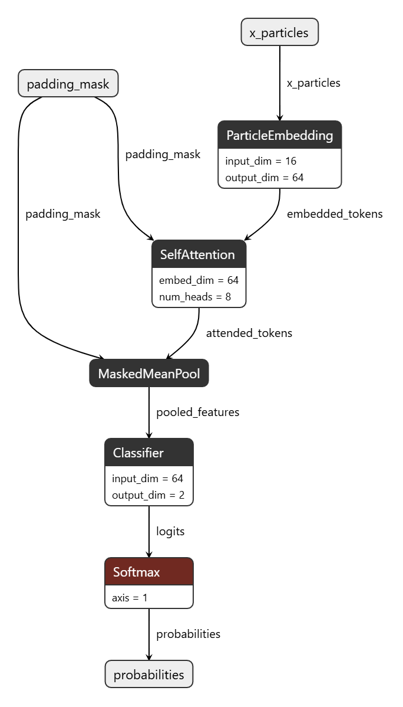

# Jet Tagger

Simple particle-transformer style classifier for jet tagging, with a shared
runtime pipeline for PyTorch, ONNX Runtime, and SOFIE benchmarking.

The project uses one canonical PyTorch model (`SimpleParT`) and can export two
different ONNX artifacts from the same checkpoint:

- `simple_part_benchmark.onnx` for runtime benchmarking.
- `simple_part_visual.onnx` for Netron/model visualization.

The trained PyTorch model in `core/model.py` remains the source of truth. The
runtime pipeline starts from the frozen checkpoint and does not introduce a
separate model implementation for benchmarking.

## Model Structure

The current `SimpleParT` model uses a linear particle embedding, a single
multi-head self-attention layer (`num_heads=8`, `embed_dim=64`), masked mean
pooling, and a final classification layer. The visualization-oriented ONNX
export shows this high-level structure directly:



The visual export ends with `Softmax` to expose probabilities more clearly. The
benchmark export stops at logits, which is the form used for runtime
measurement and loss computation.

## Project Layout

```text
core/
  data.py        ROOT reading, dense tensors, masks, normalization
  model.py       canonical PyTorch SimpleParT model
  export.py      ONNX export pipeline
  onnx_metadata.py shared ONNX metadata helpers
  benchmark.py   shared benchmark framework

scripts/
  export_onnx.py              export benchmark or visual ONNX
  export_sofie.py             generate SOFIE C++ artifacts from ONNX
  benchmark_pt.py             PyTorch benchmark
  benchmark_onnx.py           ONNX Runtime benchmark
  benchmark_sofie.py          optional SOFIE benchmark
  run_full_benchmarks.py      end-to-end benchmark pipeline + system info
  generate_benchmark_table.py benchmark markdown + metric plot
  train_simple_part.py        training script

notebooks/
  benchmark_metrics.ipynb     notebook for plotting benchmark metrics

artifacts/
  checkpoints/  trained checkpoints and normalization
  exports/      ONNX exports
  sofie/        generated SOFIE C++ artifacts (.hxx/.dat)
  logs/         benchmark JSON files and plots
```

## Setup

Install the runtime dependencies:

```bash
python -m venv .venv
source .venv/bin/activate
pip install -r requirements.txt
```

On SWAN, if the project is opened inside a preconfigured LCG/SWAN software
environment, you can usually run the scripts directly without creating a local
virtual environment or installing dependencies yourself.

## Expected Inputs

The default scripts expect:

```text
artifacts/checkpoints/simple_part_best.pt
data/
  train/
  val/
  test/
```

The data loader searches for ROOT files named like:

```text
HToBB_*.root
HToGG_*.root
```

inside the selected split directory. `HToBB` is treated as label `1`, and
`HToGG` as label `0`.

## Train the Model

To train the model used in the export and benchmark pipeline, run:

```bash
python scripts/train_simple_part.py
```

This produces the training artifacts used later by the runtime pipeline:

- `artifacts/checkpoints/simple_part_best.pt`
- `artifacts/checkpoints/simple_part_checkpoint.pt`
- `artifacts/checkpoints/particle_norm.npz`
- `artifacts/logs/train.log`

Training options you are most likely to adjust:

- `--epochs` to change the number of training epochs
- `--lr` to change the learning rate
- `--device` to choose `cpu` or `cuda`
- `--resume` to continue from the last saved checkpoint
- `--limit-files` to restrict the number of ROOT files for a quick test run
- `--max-train-batches` to cap the number of training batches per epoch
- `--max-val-batches` to cap the number of validation batches
- `--max-constituents` to change the number of particles kept per jet
- `--step-size` to control ROOT reading chunk size

Example notebook used for the binary setup:

- Kaggle notebook: https://www.kaggle.com/code/morius/jetclassbinaryclassifier
- Kaggle dataset: https://www.kaggle.com/datasets/morius/jetclass-htobb-htogg

The export and benchmark pipeline below assumes that
`artifacts/checkpoints/simple_part_best.pt` already exists.

## Export ONNX

There are two ONNX export variants.

### Benchmark ONNX

Use this for ONNX Runtime benchmarking:

```bash
python scripts/export_onnx.py --variant benchmark
```

Default output:

```text
artifacts/exports/simple_part_benchmark.onnx
```

This export is optimized for benchmarking:

- output is `logits`
- input normalization is embedded
- batch axis is dynamic
- intended for `scripts/benchmark_onnx.py`

### Visual ONNX

Use this for Netron/model visualization:

```bash
python scripts/export_onnx.py --variant visual
```

Default output:

```text
artifacts/exports/simple_part_visual.onnx
```

This export is meant to be easier to inspect visually:

- output is `probabilities`
- no embedded normalization by default
- static batch by default
- not intended as the main benchmark artifact

## Run Benchmarks

### PyTorch

```bash
python scripts/benchmark_pt.py
```

Default output:

```text
artifacts/logs/benchmark_pytorch.json
```

Useful quick test:

```bash
python scripts/benchmark_pt.py --max-events 2048
```

### ONNX Runtime

Export the benchmark ONNX first:

```bash
python scripts/export_onnx.py --variant benchmark
```

Then run:

```bash
python scripts/benchmark_onnx.py
```

Default output:

```text
artifacts/logs/benchmark_onnx.json
```

Useful quick test:

```bash
python scripts/benchmark_onnx.py --max-events 2048
```

### SOFIE

In principle, the SOFIE pipeline can be run in WSL/Linux with PyROOT, and that
was the first route explored here. In practice, setting up a suitable local
ROOT environment can take a long time, so the final workflow was moved to SWAN,
where a bleeding-edge ROOT environment was available out of the box.

Example WSL setup:

```bash
micromamba create -n sofie-env -c conda-forge python=3.12 root numpy psutil awkward uproot onnx matplotlib
micromamba activate sofie-env
cd /mnt/c/Users/<user>/path/to/jet-tagger
```

Export fresh SOFIE artifacts with the same ROOT version that will run the
benchmark. The canonical runtime pipeline is:

```text
checkpoint -> benchmark ONNX -> native SOFIE .hxx/.dat -> PyTorch / ONNX / SOFIE benchmarks -> markdown + PNG
```

SOFIE uses the same benchmark ONNX graph as ONNX Runtime.

```bash
python scripts/export_onnx.py --variant benchmark
python scripts/export_sofie.py
```

Default generated files:

```text
artifacts/sofie/simple_part.hxx
artifacts/sofie/simple_part.dat
```

Then run:

```bash
python scripts/benchmark_sofie.py --onnx artifacts/exports/simple_part_benchmark.onnx --input-normalization never
```

Useful quick test:

```bash
python scripts/benchmark_sofie.py --onnx artifacts/exports/simple_part_benchmark.onnx --input-normalization never --max-events 2048 --warmup-runs 1 --measure-runs 1 --batch-size 128
```

The benchmark writes:

```text
artifacts/logs/benchmark_sofie.json
```

`simple_part_benchmark.onnx` already embeds input normalization. When using it
as the source graph for SOFIE, keep `--input-normalization never` to avoid
applying normalization twice.

## Generate Benchmark Plots

After running benchmarks:

```bash
python scripts/generate_benchmark_table.py
```

Outputs:

```text
artifacts/logs/benchmark_table.md
artifacts/logs/benchmark_metrics.png
```

The PNG is a metric plot, not a table screenshot. It shows:

- accuracy
- loss
- mean latency
- P95 latency
- throughput
- peak RSS

You can also open:

```text
notebooks/benchmark_metrics.ipynb
```

to inspect and regenerate the plot from a notebook.

## Typical Workflow

For a full PyTorch vs ONNX Runtime comparison:

```bash
python scripts/export_onnx.py --variant benchmark
python scripts/benchmark_pt.py
python scripts/benchmark_onnx.py
python scripts/generate_benchmark_table.py
```

For a full PyTorch + ONNX Runtime + SOFIE pipeline with system information:

```bash
python scripts/run_full_benchmarks.py
```

If a full run is too slow, keep `accuracy/loss` on the full split but limit the
number of batches used for latency and memory:

```bash
python scripts/run_full_benchmarks.py --batch-size 128 --warmup-runs 5 --measure-runs 20 --latency-max-batches 64 --memory-max-batches 64
```

This script always:

```text
1. exports benchmark ONNX
2. regenerates native SOFIE .hxx/.dat from that ONNX
3. runs the PyTorch benchmark
4. runs the ONNX Runtime benchmark
5. runs the SOFIE benchmark
6. writes system JSON, markdown table, and PNG plot
```

This writes:

```text
artifacts/logs/benchmark_pytorch.json
artifacts/logs/benchmark_onnx.json
artifacts/logs/benchmark_sofie.json
artifacts/logs/benchmark_system.json
artifacts/logs/benchmark_table.md
artifacts/logs/benchmark_metrics.png
```

For Netron visualization:

```bash
python scripts/export_onnx.py --variant visual
```

Then open:

```text
artifacts/exports/simple_part_visual.onnx
```

in Netron.

## Current Benchmark Result Shape

Benchmark JSON files use schema version `2` and contain:

- `metrics`: accuracy, loss, output kind
- `latency`: mean, p50, p95, p99, throughput
- `memory`: RSS and optional CUDA peak memory
- `batching`: requested/min/max batch size
- `artifacts`: checkpoint or ONNX file used
- `extra`: runtime-specific metadata

## Notes

- The PyTorch model is defined in `core/model.py`.
- ONNX exports are artifacts generated from the checkpoint; they are not new
  trained models.
- Benchmark ONNX and visual ONNX intentionally differ because they serve
  different purposes.
- Use `simple_part_benchmark.onnx` for measurement.
- Use `simple_part_visual.onnx` for visualization.
